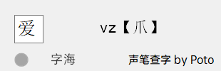

[声笔查字](https://ispoto.github.io/SingbitDict/) 是 [Poto](https://t.me/PotoGroup) 开发的声笔打字方案查字打法软件

[声笔](https://sbxlm.gitee.io/about/)是一个高效、爽、给你独特句式连续感的顶功打字方案

* * *

「声笔查字」是一个绿色免安装的良心查字软件，直接运行即可

运行「声笔查字」后可直接打字或粘贴查询

单击输入框清空上次查询字

拖拽界面边缘移动窗口

双击界面边缘退出「声笔查字」

界面将置顶显示

圆圈是「复制自动查字」模式的开关。点击灰色圆圈，进入「复制自动查字」模式，此时灰色圆圈将变色紫色圆圈。你复制单个字将自动查询打法

再次单击紫色圆圈退出「复制自动查字」模式

单击「字海」进入字海两分查询。你可在已输入字的前提下单击「字海」切换声笔编码和字海两分法编码显示。进入字海模式，字海两字将变成紫色，再次单击紫色字海退出字海两分法查询模式

